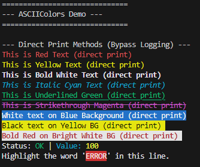
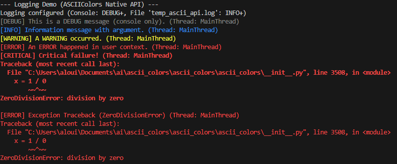
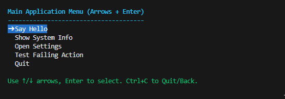
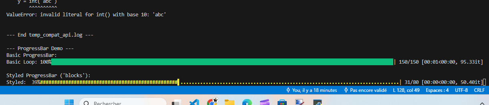

# ASCIIColors: Rich Logging, Colors, Progress Bars & Menus - All In One! 🎨🪵📊 interactive

[](https://pypi.org/project/ascii-colors/)
[](https://pypi.org/project/ascii-colors/)
[](https://github.com/ParisNeo/ascii_colors/blob/main/LICENSE)
[](https://pypi.org/project/ascii-colors/)
[](https://github.com/psf/black)

---

**Stop wrestling with multiple libraries for essential CLI features!**

**ASCIIColors** is your unified toolkit for creating modern, engaging, and informative Python terminal applications. Forget bland `print()` statements and complex logging setups. Embrace vibrant colors, structured logging, sleek progress bars, interactive menus, and helpful utilities – all from a single, elegant library.

## Simple colorful and stylish printing


## Complete logging system fully compatible with python logging library


## Full Menu management system


## TQDM like colorful progressbars


## User interaction utilities


---

## ✨ Why Choose ASCIIColors?

*   🎨 **Dual Approach:** Seamlessly switch between simple, direct color printing for immediate feedback and a powerful, structured logging system for application events.
*   🪵 **Logging Powerhouse:** Get instantly colored, leveled console logs (`stderr` default) with `basicConfig`. Easily configure file logging, JSON output, log rotation, custom formats, and context injection. Features a **`logging`-compatible API** (`getLogger`, `basicConfig`, Handlers) for painless adoption.
*   📊 **Integrated Progress Bars:** Display `tqdm`-like progress bars for loops or tasks with customizable styles (`fill`, `blocks`, `line`, `emoji`) and colors, directly integrated.
*   🖱️ **Interactive Menus:** Build intuitive, visually styled command-line menus with arrow-key navigation, different selection modes (`execute`, `select_single`, `select_multiple`), filtering, inline input fields, help text, and submenus.
*   🤝 **User Interaction:** Easily prompt users for text input (with optional hidden input for passwords) and ask for yes/no confirmation using `prompt()` and `confirm()`.
*   ⚙️ **Utilities Included:** Comes with `execute_with_animation` (console spinner), `highlight` (text emphasis), `multicolor` (inline colored text), and `trace_exception` (easy error logging).
*   🚀 **Simplify Your Stack:** Reduce project dependencies and complexity by using one library for colors, logging, progress bars, menus, and basic user interaction.
*   ✅ **Effortless Integration:** Use the familiar `import ascii_colors as logging` pattern or the native `ASCIIColors` API. Direct print methods remain independent for simple use cases.

---

## 🚀 Installation

```bash
pip install ascii_colors
```
*(Optional: For accurate wide-character support (like emojis) in ProgressBar, install `wcwidth`: `pip install wcwidth`)*

---

## 📚 Core Concepts: Direct Print vs. Logging System

Understanding this difference is fundamental:

1.  **Direct Print Methods (`ASCIIColors.red`, `print`, `bold`, `bg_red`, `prompt`, `confirm`, etc.):**
    *   **Mechanism:** Use Python's `print()` (or `input`/`getpass`) to **directly** interact with the terminal (default: `sys.stdout`/`stdin`). Outputs strings with specified ANSI colors/styles.
    *   **Scope:** **Completely bypasses** the logging system. Levels, Handlers, Formatters, Context are **ignored**.
    *   **Use Case:** Ideal for immediate visual feedback, status messages, banners, prompts, user input/confirmation, menus, progress bars, animations, or decorative output where structured logging features aren't necessary.

2.  **Logging System (`basicConfig`, `getLogger`, `logger.info`, `ASCIIColors.info`, Handlers, Formatters):**
    *   **Mechanism:** Creates structured log records, filters them by level, formats them into strings using `Formatters`, and dispatches them via `Handlers` to destinations (console, file, etc.). Mimics Python's standard `logging` module.
    *   **Scope:** Provides leveled logging, output routing, filtering, contextual information, and flexible formatting. Console output is typically colored by log level.
    *   **Interaction:** Use `import ascii_colors as logging` (recommended) or `ASCIIColors.info()` methods. Both control the *same* global logging state.
    *   **Use Case:** Best for application logs, debugging, tracing events, audit trails – any scenario needing structured, configurable, and routable output.

*Utility Interactions:* `highlight`, `multicolor`, `execute_with_animation`, `Menu`, `ProgressBar`, `confirm`, and `prompt` use **Direct Printing** for their visual output/interaction. `trace_exception` uses the **Logging System**.

---

## 🎨 Direct Printing In-Depth

Instantly add color and style to terminal output.

### Basic Usage

Call static methods on `ASCIIColors` for specific colors or styles.

```python
from ascii_colors import ASCIIColors

ASCIIColors.red("Error: File processing failed.")
ASCIIColors.green("Success: Data saved.")
ASCIIColors.yellow("Warning: Using default value.")
ASCIIColors.blue("Info: Connecting to server...")
ASCIIColors.bold("This is important!")
ASCIIColors.underline("Please read the instructions.")
ASCIIColors.italic("Note: This is experimental.", color=ASCIIColors.color_magenta) # Combine style method with color arg
```

### Advanced Usage with `ASCIIColors.print()`

The core direct print method offers full control.

```python
from ascii_colors import ASCIIColors
import sys

# Syntax: print(text, color=..., style=..., background=..., end=..., flush=..., file=...)

ASCIIColors.print(
    " Detailed Status ",
    color=ASCIIColors.color_black,           # Foreground color constant
    style=ASCIIColors.style_bold,            # Style constant
    background=ASCIIColors.color_bg_cyan,    # Background color constant
    end="\n\n",                              # Custom line ending
    flush=True,                              # Force flush buffer
    file=sys.stdout                          # Specify output stream
)

# Combine multiple styles
combined_style = ASCIIColors.style_bold + ASCIIColors.style_underline + ASCIIColors.style_italic
ASCIIColors.print(
    "Multi-styled Text",
    color=ASCIIColors.color_bright_white,
    style=combined_style
)
```

### Available Colors & Styles Constants

Access these as `ASCIIColors.<constant_name>`:

*   **Reset:** `color_reset` (resets all)
*   **Styles:**
    *   `style_bold`
    *   `style_dim`
    *   `style_italic`
    *   `style_underline`
    *   `style_blink` (support varies)
    *   `style_reverse` (swaps foreground/background)
    *   `style_hidden` (support varies)
    *   `style_strikethrough`
*   **Foreground (Regular):** `color_black`, `color_red`, `color_green`, `color_yellow`, `color_blue`, `color_magenta`, `color_cyan`, `color_white`, `color_orange` (256-color)
*   **Foreground (Bright):** `color_bright_black` (gray), `color_bright_red`, `color_bright_green`, `color_bright_yellow`, `color_bright_blue`, `color_bright_magenta`, `color_bright_cyan`, `color_bright_white`
*   **Background (Regular):** `color_bg_black`, `color_bg_red`, `color_bg_green`, `color_bg_yellow`, `color_bg_blue`, `color_bg_magenta`, `color_bg_cyan`, `color_bg_white`, `color_bg_orange` (256-color)
*   **Background (Bright):** `color_bg_bright_black` (gray), `color_bg_bright_red`, `color_bg_bright_green`, `color_bg_bright_yellow`, `color_bg_bright_blue`, `color_bg_bright_magenta`, `color_bg_bright_cyan`, `color_bg_bright_white`

*(Note: Rendering depends on terminal emulator capabilities.)*

### Inline Multicolor Text (`multicolor`)

Print segments with different styles on the same line.

```python
from ascii_colors import ASCIIColors

ASCIIColors.multicolor(
    # List of text segments
    ["Processing: ", "FileA.txt", " [", "OK", "] ", "Size: ", "1.2MB"],
    # Corresponding list of color/style constants
    [
        ASCIIColors.color_white,              # "Processing: "
        ASCIIColors.color_cyan,               # "FileA.txt"
        ASCIIColors.color_white,              # " ["
        ASCIIColors.color_green + ASCIIColors.style_bold, # "OK" (bold green)
        ASCIIColors.color_white,              # "] "
        ASCIIColors.color_white,              # "Size: "
        ASCIIColors.color_yellow              # "1.2MB"
    ]
)
# Output: Processing: FileA.txt [OK] Size: 1.2MB (with styles applied)
```

### Highlighting Substrings (`highlight`)

Emphasize parts of a string.

```python
from ascii_colors import ASCIIColors

log_entry = "ERROR: Failed login attempt for user 'admin' from IP 192.168.1.101"

ASCIIColors.highlight(
    text=log_entry,
    subtext=["ERROR", "admin", "192.168.1.101"], # String or list of strings to find
    color=ASCIIColors.color_white,             # Default text color
    highlight_color=ASCIIColors.color_bright_yellow + ASCIIColors.style_underline, # Style for matches
    # whole_line=True                          # Set True to highlight the entire line if a match is found
)
# Output: ERROR: Failed login attempt for user 'admin' from IP 192.168.1.101
#         ^^^^^                               ^^^^^          ^^^^^^^^^^^^^^^ (highlighted)
```

### Persistent Styles (`activate`/`reset`)

Apply a style that stays active until reset (less common, use `print` usually).

```python
from ascii_colors import ASCIIColors

ASCIIColors.activate(ASCIIColors.color_blue + ASCIIColors.style_italic)
print("This text will be blue and italic.")
print("This text will also be blue and italic.")
ASCIIColors.reset() # Reset to terminal default
print("This text is back to normal.")
```

---

## 🪵 Logging System In-Depth

Build robust, structured, and configurable logs.

### The Compatibility Layer (`import ascii_colors as logging`)

**This is the recommended way to use the logging system.** It provides a familiar interface.

```python
import ascii_colors as logging # The key alias!

# Configure using basicConfig
logging.basicConfig(level=logging.INFO)

# Get and use loggers
logger = logging.getLogger("MyService")
logger.info("Service started.")
```

### Configuration with `basicConfig()`

The easiest way to set up basic logging. **Call it only once** at application start (unless `force=True`).

**Common Parameters:**

*   `level`: Minimum level for the root logger (and default handlers). E.g., `logging.DEBUG`, `"INFO"`, `30`. Default: `WARNING`.
*   `format` (or `fmt`): Log message format string (see [Formatter Placeholders](#-formatter-placeholders)). Default: `%(levelname)s:%(name)s:%(message)s` (uses `%` style).
*   `datefmt`: Format string for `%(asctime)s`. Default: ISO-like `"%Y-%m-%d %H:%M:%S,%f"`.
*   `style`: Format string style (`'%'` or `'{'`). Default: `'%'`.
*   `stream`: Target stream for the default `ConsoleHandler` (e.g., `sys.stdout`). Default: `sys.stderr`. Ignored if `filename` or `handlers` is used.
*   `filename`: Path to log file. Creates a `FileHandler`. Incompatible with `stream` or `handlers`.
*   `filemode`: File open mode (`'a'` append, `'w'` write). Default: `'a'`. Requires `filename`.
*   `encoding`: File encoding (e.g., `'utf-8'`). Requires `filename`.
*   `handlers`: A list of pre-configured handler instances. If provided, `stream` and `filename` are ignored.
*   `force`: If `True`, removes existing handlers before configuring. Allows calling `basicConfig` multiple times. Default: `False`.

**Examples:**

```python
import ascii_colors as logging
from pathlib import Path
import sys

# Example 1: Simple colored console logging (INFO+) to stdout
# logging.basicConfig(level=logging.INFO, stream=sys.stdout, format='[%(levelname)s] %(message)s')

# Example 2: Log DEBUG+ to a file, overwrite on start
# log_file = Path("app.log")
# logging.basicConfig(level=logging.DEBUG, filename=log_file, filemode='w',
#                     format='%(asctime)s - %(name)s - %(levelname)s - %(message)s')

# Example 3: Log INFO+ to console (stderr) AND DEBUG+ to a file
log_file = Path("app_combined.log")
# Configure console handler via basicConfig
logging.basicConfig(level=logging.INFO, format='%(levelname)s: %(message)s')
# Manually create and add file handler
file_formatter = logging.Formatter('%(asctime)s | %(message)s')
file_handler = logging.FileHandler(log_file, level=logging.DEBUG, formatter=file_formatter)
logging.getLogger().addHandler(file_handler) # Add to root logger

logger = logging.getLogger("Combined")
logger.info("Goes to console and file.")
logger.debug("Goes to file only.")
```

### Manual Configuration (Full Control)

For complex scenarios involving multiple handlers, specific formatters, or fine-grained control.

**Steps:**

1.  **Get Logger:** `logger = logging.getLogger("MyComponent")` (Use names like `parent.child` for hierarchy).
2.  **Create Formatter(s):**
    *   `fmt = logging.Formatter(fmt=..., datefmt=..., style=..., include_source=...)`
    *   `json_fmt = logging.JSONFormatter(fmt=..., datefmt=..., style=..., include_fields=..., ...)`
3.  **Create Handler(s):**
    *   `con_h = logging.ConsoleHandler(stream=..., level=..., formatter=...)` (or `StreamHandler`)
    *   `file_h = logging.FileHandler(filename=..., mode=..., encoding=..., level=..., formatter=...)`
    *   `rot_h = logging.handlers.RotatingFileHandler(filename=..., maxBytes=..., backupCount=..., level=..., formatter=...)`
4.  **Add Handlers to Logger:** `logger.addHandler(handler_instance)` (or add to root logger `logging.getLogger().addHandler(...)` to affect all loggers).
5.  **Set Logger Level (Optional):** `logger.setLevel(logging.DEBUG)` (Controls messages passed *from this logger* to its handlers. Global level `ASCIIColors.set_log_level` filters *before* any logger).

**Example:**

```python
import ascii_colors as logging
from ascii_colors import handlers # Access RotatingFileHandler
from pathlib import Path
import sys

# --- Get Loggers ---
root_logger = logging.getLogger() # Configure root for global effect
module_logger = logging.getLogger("MyModule")

# --- Set Levels ---
# Global filter: Allow DEBUG and above to reach loggers
logging.ASCIIColors.set_log_level(logging.DEBUG)
# Root logger filter: Allow INFO and above to pass to its handlers
root_logger.setLevel(logging.INFO)

# --- Create Formatters ---
console_format = "[{levelname:<8}] {message} ({name})"
console_fmt = logging.Formatter(console_format, style='{', datefmt='%H:%M:%S')

file_format = "%(asctime)s|%(levelname)-8s|%(name)s:%(lineno)d|%(message)s"
file_fmt = logging.Formatter(file_format, style='%', include_source=True) # Include source info

# --- Create Handlers ---
console_handler = logging.ConsoleHandler(stream=sys.stdout, level=logging.INFO) # INFO+
console_handler.setFormatter(console_fmt)

file_handler = logging.FileHandler("manual_app.log", mode='w', level=logging.DEBUG) # DEBUG+
file_handler.setFormatter(file_fmt)

# --- Add Handlers to Root Logger ---
# Clear previous handlers if re-configuring
root_logger.handlers.clear() # Or use basicConfig(force=True) initially
root_logger.addHandler(console_handler)
root_logger.addHandler(file_handler)

# --- Log Messages ---
module_logger.info("Module starting.") # Goes to console & file
module_logger.debug("Low-level details.") # Goes to file only (filtered by console handler level)
```

### Formatter Placeholders

Use these within `format` strings (`fmt` parameter):

*   **`%` Style (Default):**
    *   `%(asctime)s`: Human-readable time (configured by `datefmt`).
    *   `%(created)f`: Time of creation (float, `time.time()`).
    *   `%(filename)s`: Filename part of pathname. Requires `include_source=True`.
    *   `%(funcName)s`: Name of function containing the log call. Requires `include_source=True`.
    *   `%(levelname)s`: Text logging level ('DEBUG', 'INFO', etc.).
    *   `%(levelno)s`: Numeric logging level (10, 20, etc.).
    *   `%(lineno)d`: Line number where log call occurs. Requires `include_source=True`.
    *   `%(message)s`: The logged message itself.
    *   `%(module)s`: Module name (filename without extension). Requires `include_source=True`.
    *   `%(msecs)d`: Millisecond portion of timestamp.
    *   `%(name)s`: Name of the logger used.
    *   `%(pathname)s`: Full path to the source file. Requires `include_source=True`.
    *   `%(process)d`: Process ID.
    *   `%(processName)s`: Process name (usually Python thread name).
    *   `%(relativeCreated)d`: Time in milliseconds since logger initialized.
    *   `%(thread)d`: Thread ID.
    *   `%(threadName)s`: Thread name.
    *   `%(<custom_key>)s`: Any key passed via `extra={...}` or context.
*   **`{}` Style:** Use the same names within braces, e.g., `{asctime}`, `{levelname}`, `{name}`, `{message}`, `{filename}`, `{lineno}`, `{funcName}`, `{custom_key}`.

**Note:** Retrieving `filename`, `pathname`, `lineno`, `funcName`, `module` requires setting `include_source=True` on the `Formatter`, which adds performance overhead due to stack inspection.

### JSON Formatter (`JSONFormatter`)

Log structured JSON, ideal for log aggregation systems.

```python
import ascii_colors as logging
from pathlib import Path

log_file = Path("audit.jsonl")

# Configure JSON Formatter
json_formatter = logging.JSONFormatter(
    # Option 1: Define exact output structure with fmt dict (values are format strings)
    fmt={
        "ts": "%(asctime)s",
        "lvl": "%(levelname)s",
        "log": "%(name)s",
        "msg": "%(message)s",
        "ctx": { # Nested context example
            "request": "%(request_id)s",
            "user": "%(user_id)s",
            "file": "%(filename)s" # Requires include_source=True if using this
        },
        "exc_info": "%(exc_info)s" # Include formatted exception string if present
    },
    # Option 2: Alternatively, select standard fields to include
    # include_fields=["asctime", "levelname", "name", "message", "user_id", "request_id", "exc_info", "exc_type"],
    datefmt="iso",         # Use ISO 8601 timestamps
    style='%',             # Style for resolving format strings in fmt dict
    json_ensure_ascii=False, # Allow UTF-8 characters
    json_indent=None,      # Set to integer (e.g., 2) for pretty-printing (usually None for log files)
    json_sort_keys=False,  # Preserve order from fmt dict if possible
    include_source=True    # Needed if format strings reference source info
)

# Setup handler using the JSON formatter
json_handler = logging.FileHandler(log_file, mode='w')
json_handler.setFormatter(json_formatter)

logging.basicConfig(level=logging.INFO, handlers=[json_handler], force=True) # Use only this handler

logger = logging.getLogger("API")
try:
    1 / 0
except Exception as e:
     # Pass context via 'extra' and include exception info
     logger.error("Processing failed for request.",
                  extra={"user_id": "usr_456", "request_id": "req_xyz"},
                  exc_info=True) # Logs the exception details

# Log file 'audit.jsonl' will contain a JSON object per line (JSON Lines format)
```

### Logging Messages & Exceptions

Use standard logger methods.

```python
import ascii_colors as logging
from ascii_colors import trace_exception # Utility function

logging.basicConfig(level=logging.DEBUG) # Basic setup
logger = logging.getLogger("Processor")

# Standard levels
logger.debug("Starting step %d...", 1)
logger.info("Processing record %s.", "ID-001")
logger.warning("Timeout occurred for %s.", "ID-002")
logger.error("Failed to write output for %s.", "ID-003")
logger.critical("System integrity check failed!")

# Logging with %-style arguments
logger.info("User %s performed action %s on resource %d.", "admin", "UPDATE", 42)

# Logging exceptions
try:
    result = 1 / 0
except ZeroDivisionError as e:
    # Option 1: logger.exception (in except block) - logs at ERROR level
    logger.exception("Arithmetic error during calculation for ID %s.", "ID-004")
    # Option 2: logger.error with exc_info=True
    # logger.error("Arithmetic error occurred", exc_info=True)
    # Option 3: trace_exception utility (logs at ERROR level)
    # trace_exception(e)
```

### Context Management (Thread-Local)

Enrich logs automatically with contextual data relevant to the current thread or task.

1.  **Set Context:**
    *   `ASCIIColors.set_context(key1=value1, key2=value2)`: Sets context for the current thread.
    *   `with ASCIIColors.context(key1=value1, key2=value2): ...`: Sets context only within the `with` block. Automatically restores previous state on exit.
2.  **Configure Formatter:** Ensure your `Formatter` includes the context keys (e.g., `%(request_id)s` or `{request_id}`).
3.  **Log:** Messages logged within the context scope will include the values.

```python
from ascii_colors import ASCIIColors, Formatter, ConsoleHandler, getLogger, INFO
import threading, time, sys

# Formatter includes context keys 'req_id' and 'user'
fmt_string = "[{asctime}] Req:{req_id}|User:{user} [{levelname}] {message}"
formatter = Formatter(fmt_string, style='{', datefmt='%H:%M:%S')
handler = ConsoleHandler(stream=sys.stdout, formatter=formatter)
# Apply setup (clearing previous handlers for clarity)
ASCIIColors.clear_handlers(); ASCIIColors.add_handler(handler); ASCIIColors.set_log_level(INFO)
logger = getLogger("ContextDemo")

def handle_request(request_id, user_name):
    # Use context manager for automatic cleanup
    with ASCIIColors.context(req_id=request_id, user=user_name):
        logger.info("Request received")
        # Simulate work
        time.sleep(0.05)
        logger.info("Processing complete")

# Simulate concurrent requests
threads = [
    threading.Thread(target=handle_request, args=(f"R{i}", f"User{i}")) for i in range(3)
]
for t in threads: t.start()
for t in threads: t.join()

# Output will automatically include the correct req_id and user for each log line
```
You can retrieve the current context dictionary using `ASCIIColors.get_thread_context()`.

---

## 📊 Progress Bar (`ProgressBar`)

Display `tqdm`-like progress indicators. Uses **Direct Printing**.

**Key Parameters:**

*   `iterable`: Optional iterable to wrap (like `tqdm(iterable)`).
*   `total`: Total number of expected iterations (required if `iterable` has no `len`).
*   `desc`: String description prefix.
*   `unit`: Label for iterations (default: "it").
*   `ncols`: Fixed width for the entire bar; `None` for auto-detect.
*   `bar_format`: Custom format string. Use placeholders like `{l_bar}`, `{bar}`, `{r_bar}`, `{n_fmt}`, `{total_fmt}`, `{percentage}`, `{elapsed}`, `{remaining}`, `{rate_fmt}`. For indeterminate bars (no total), only `{l_bar}`, `{bar}`, `{n}`, `{elapsed}`, `{rate_fmt}`, `{unit}` are reliably substituted.
*   `leave`: Keep the completed bar on screen (`True`) or clear it (`False`). Default: `True`.
*   `mininterval`: Minimum time in seconds between display updates. Default: `0.1`.
*   `color`, `style`, `background`: `ASCIIColors` constants for bar/text styling.
*   `bar_style`: `'fill'` (default, solid block), `'blocks'` (smoother Unicode blocks), `'line'` (growing line), `'emoji'` (uses custom chars).
*   `progress_char`, `empty_char`: Characters for filled/empty parts. Ignored for `'emoji'`. Defaults vary by `bar_style`.
*   `emoji_fill`, `emoji_empty`: Characters used for `'emoji'` style (defaults: 😊, 😞).

**Examples:**

```python
from ascii_colors import ProgressBar, ASCIIColors
import time

# --- Example 1: Wrapping an iterable ('fill' style) ---
items = range(200)
print("Wrapping an iterable:")
for item in ProgressBar(items, desc="Processing", unit=" tasks", color=ASCIIColors.color_green):
    time.sleep(0.01)

# --- Example 2: Manual control, 'blocks' style ---
print("\nManual control ('blocks' style):")
total_size = 500
with ProgressBar(total=total_size, desc="Downloading", unit=" KB",
                 color=ASCIIColors.color_bright_blue, style=ASCIIColors.style_bold,
                 bar_style="blocks", # Use smooth block style
                 mininterval=0.05) as pbar:
    for i in range(total_size):
        time.sleep(0.005)
        pbar.update(1) # Increment progress
        if i == total_size // 2:
            pbar.set_description("Half done...") # Update description dynamically

# --- Example 3: 'line' style ---
print("\n'line' style:")
for item in ProgressBar(range(100), desc="Line Task", bar_style='line', color=ASCIIColors.color_magenta):
     time.sleep(0.015)

# --- Example 4: 'emoji' style ---
print("\n'emoji' style:")
for item in ProgressBar(range(60), desc="Rockets", bar_style='emoji',
                        emoji_fill="🚀", emoji_empty="🌑"):
    time.sleep(0.03)

# --- Example 5: Indeterminate (no total) ---
print("\nIndeterminate style:")
with ProgressBar(desc="Waiting...", color=ASCIIColors.color_yellow) as pbar:
     for _ in range(5):
         time.sleep(0.5)
         pbar.update(10) # Can still track counts
```

---

## 🖱️ Interactive Menu (`Menu`)

Build styled CLI menus with arrow-key navigation, different modes, filtering, and input. Uses **Direct Printing**.

**Key `Menu` Parameters:**

*   `title`: Menu title.
*   `parent`: Link to parent `Menu` for 'Back' navigation.
*   `mode`: `'execute'` (run actions), `'select_single'` (return one value), `'select_multiple'` (return list of values). Default: `'execute'`.
*   `clear_screen_on_run`: Clear terminal before showing (`True`).
*   `hide_cursor`: Attempt to hide cursor during interaction (`True`).
*   `enable_filtering`: Allow typing to filter items (`False`).
*   `help_area_height`: Number of lines reserved below menu for help text (`0`).
*   Styling: `title_color`, `item_color`, `selected_color`, `selected_background`, `prompt_color`, `error_color`, `filter_color`, `help_color`, etc.
*   Prefixes: `selected_prefix`, `unselected_prefix`, `checkbox_selected`, etc.

**Adding Items:**

*   `.add_action(text, function, *, value=None, exit_on_success=False, item_color=None, help_text=None, disabled=False)`
*   `.add_submenu(text, submenu_instance, *, value=None, item_color=None, help_text=None, disabled=False)`
*   `.add_choice(text, *, value=None, selected=False, item_color=None, help_text=None, disabled=False)`: For use in `select_single`/`select_multiple` modes.
*   `.add_choices(choices):` Adds multiple choice items from a list of `(text, value)` tuples. Convenient for `select_single`/`select_multiple` modes.
*   `.add_input(text, *, initial_value="", placeholder="{input}", value=None, item_color=None, help_text=None, disabled=False)`: Inline text input.
*   `.add_separator(text=None)`

**Navigation & Interaction:**

*   **Arrows Up/Down:** Move selection.
*   **Enter:**
    *   Execute action or enter submenu (in `execute` mode).
    *   Select item and exit menu (in `select_single` mode).
    *   Toggle item selection (in `select_multiple` mode - see Note below).
    *   Start editing input field.
*   **Space:** Toggle item selection (in `select_multiple` mode).
*   **Typing (if `enable_filtering=True`):** Filters the list of items. `Backspace` removes characters from filter.
*   **Ctrl+C:** Quit main menu, or go back in submenu.
*   **Input Field Editing:** Use `Left`/`Right`/`Backspace`/`Printable Keys`. `Enter`/`Escape` finishes editing.

*Note on Multi-Select Enter:* By default, Enter toggles items in `select_multiple` mode. If you add an `action` to a choice in multi-select, Enter will *execute* that action instead of toggling. Use Spacebar for toggling in those cases.

**Example:**

```python
from ascii_colors import Menu, MenuItem, ASCIIColors
import platform, time

def action_ok(): ASCIIColors.green("Action OK!")
def action_exit_success(): ASCIIColors.success("Exiting Menu!"); return True # Causes menu exit

# --- Menus ---
root = Menu("Unified CLI Menu", enable_filtering=True, help_area_height=2)
single_sel = Menu("Select Format", parent=root, mode='select_single')
multi_sel = Menu("Select Features", parent=root, mode='select_multiple')

# --- Root Items ---
root.add_action("Show Platform", lambda: ASCIIColors.info(f"OS: {platform.system()}"),
                help_text="Display the current operating system.")
root.add_submenu("Choose Format", single_sel, help_text="Select one output format.")
root.add_submenu("Configure Features", multi_sel, help_text="Toggle multiple features (Spacebar).")
root.add_action("Action That Exits", action_exit_success, exit_on_success=True,
                help_text="This action will close the menu if it succeeds.")
root.add_separator()
root.add_input("Enter Username: ", initial_value="guest", help_text="Type a username here.")
root.add_action("Disabled Action", action_ok, disabled=True)

# --- Submenu Items ---
# Using add_choices for single_sel
single_sel.add_choices([
    ("Text", "txt"),
    ("JSON", "json"),
    ("YAML", "yaml"), # Value defaults to "YAML"
])
# Add help text separately if needed after add_choices
single_sel.items[0].help_text = "Plain text format."
single_sel.items[1].help_text = "JSON format."
single_sel.items[2].disabled = True # Disable YAML

# Using add_choices for multi_sel
multi_sel.add_choices([
    ("Verbose Logging", "VERBOSE"),
    ("Auto Save", "AUTOSAVE"),
    ("Notifications", "NOTIFY"),
])
# Set initial selection state after add_choices
multi_sel.items[0].selected = True
multi_sel.items[2].selected = True


# --- Run ---
ASCIIColors.print("\nStarting interactive menu demo (Arrows, Enter, Space, Type to filter, Ctrl+C)...\n", color=ASCIIColors.color_yellow)
result = root.run() # Run the main menu

ASCIIColors.print("\n--- Menu Result ---", color=ASCIIColors.color_bright_white)
if isinstance(result, list):
    ASCIIColors.print(f"Multi-select returned: {result}", color=ASCIIColors.color_green)
elif result is not None:
    ASCIIColors.print(f"Single-select or Exit Action returned: {result}", color=ASCIIColors.color_cyan)
else:
    ASCIIColors.print("Menu exited (Quit/Back/Execute mode completed).", color=ASCIIColors.color_yellow)

# Access input value after run (find the item by text or other means)
input_item = next((item for item in root.items if item.is_input), None)
if input_item:
    ASCIIColors.print(f"Username entered was: '{input_item.input_value}'", color=ASCIIColors.color_magenta)

```

---

## ⏳ Animation Spinner (`execute_with_animation`)

Provide visual feedback during blocking operations. Uses **Direct Printing**.

**Key Parameters:**

*   `pending_text`: Text displayed next to the spinner.
*   `func`: The function/callable to execute while the spinner runs.
*   `*args`, `**kwargs`: Arguments passed to `func`.
*   `color`: Optional `ASCIIColors` color constant for the `pending_text`.

**How it Works:**

1.  Displays `pending_text` and an animated spinner (using direct print).
2.  Runs `func(*args, **kwargs)` in a separate thread.
3.  *Logging within `func` uses the configured Logging System normally.*
4.  When `func` finishes:
    *   Stops the spinner.
    *   Prints a final status line (✓ for success, ✗ for failure) using direct print.
    *   Returns the result of `func`.
    *   If `func` raised an exception, `execute_with_animation` re-raises it.

**Example:**

```python
from ascii_colors import ASCIIColors, trace_exception
import time
import ascii_colors as logging # For logging inside the task

logging.basicConfig(level=logging.INFO, format='>> %(message)s') # Configure logging

def simulate_api_call(endpoint):
    logger = logging.getLogger("APICall")
    logger.info(f"Calling endpoint: {endpoint}") # Log inside the task
    time.sleep(2)
    if endpoint == "fail":
        raise ConnectionError("Could not connect to API")
    return {"status": "OK", "data": [1, 2, 3]}

print("\nExecuting task with spinner:")
try:
    result = ASCIIColors.execute_with_animation(
        "Calling API...", simulate_api_call, "users", # args for simulate_api_call
        color=ASCIIColors.color_bright_magenta
    )
    ASCIIColors.success(f"API Call Successful: {result}") # Use direct print for overall status
except Exception as e:
    ASCIIColors.fail(f"API Call Failed: {e}")
    # Optionally log the failure again using the logging system
    # trace_exception(e)
```

---
## 🤝 User Interaction (`confirm` / `prompt`)

Easily get confirmations or text input from the user directly in the terminal. These methods use **Direct Printing** for the prompts.

*   **`ASCIIColors.confirm(question, default_yes=None, ...)`**: Asks a Yes/No question.
    *   Handles `y/yes` and `n/no` (case-insensitive).
    *   `default_yes=True`: Enter defaults to Yes (`[Y/n]`).
    *   `default_yes=False`: Enter defaults to No (`[y/N]`).
    *   `default_yes=None`: Enter is invalid (`[y/n]`).
    *   Returns `True` for Yes, `False` for No (or Ctrl+C).

*   **`ASCIIColors.prompt(prompt_text, color=..., style=..., hide_input=False, ...)`**: Displays a styled prompt and reads a line of text.
    *   Returns the user's input string.
    *   Returns an empty string if cancelled with Ctrl+C.
    *   `hide_input=True`: Don't echo input characters (uses `getpass`).

```python
from ascii_colors import ASCIIColors

# --- Confirmation Examples ---
delete_it = ASCIIColors.confirm("Are you sure you want to delete the file?", default_yes=False)
if delete_it:
    print("Deleting...")
else:
    print("Deletion cancelled.")

proceed = ASCIIColors.confirm("Continue with installation?", default_yes=True)


# --- Prompt Examples ---
name = ASCIIColors.prompt("Enter your name: ", color=ASCIIColors.color_cyan)
api_key = ASCIIColors.prompt(
    "Enter your API key: ",
    color=ASCIIColors.color_yellow,
    style=ASCIIColors.style_bold,
    hide_input=True # Hide the input
)
if api_key:
    print("API Key received.")
else:
    # Could be empty input or Ctrl+C
    print("API Key entry skipped or cancelled.")
```

---

## 📚 API & Documentation

This README covers the primary functionalities. For a complete API reference and further details, please visit the **[Full Documentation](https://parisneo.github.io/ascii_colors/)**.

---

## 🤝 Contributing

Your contributions are welcome! Please see [CONTRIBUTING.md](CONTRIBUTING.md) for guidelines on reporting issues, proposing features, and submitting pull requests.

---

## 📜 License

ASCIIColors is distributed under the Apache License 2.0. See the [LICENSE](LICENSE) file for more information.

---

**Elevate your command-line applications. Choose `ascii_colors` for a unified, powerful, and visually appealing experience!**
